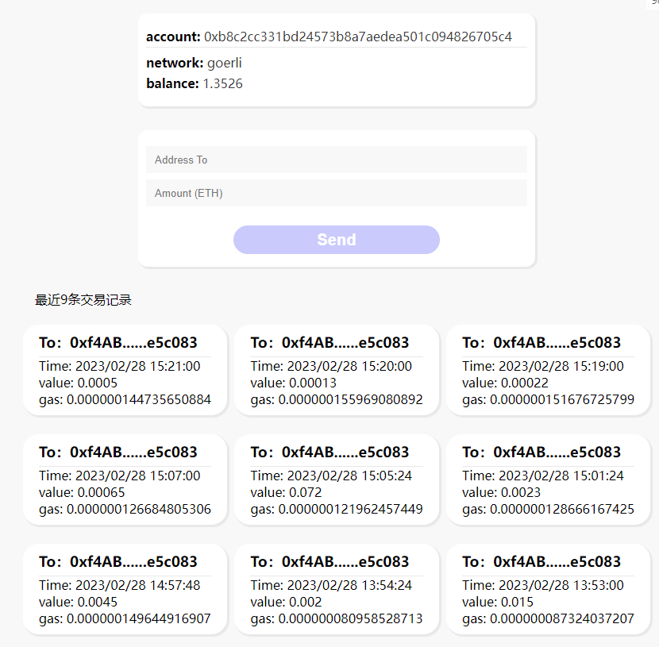

## 项目预览

[预览地址](https://lll618xxx.github.io/xx-web3/)

### Dapp项目

包含的功能

- 连接钱包
- 转账ETH
- 交易记录



#### 安装依赖

```
cd app & npm i
```

#### 运行项目

```
npm run dev
```

#### 查询交易记录

在 <code>.env</code> 文件中，填写ETHERSSCAN_API_KEY


